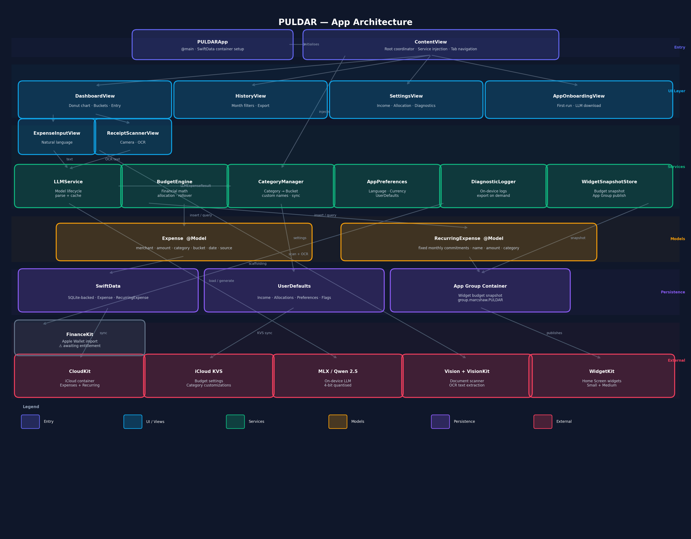

# PULDAR

> **Offline-first budgeting for people who want speed, privacy, and daily clarity.**

PULDAR is a native iOS budgeting app that turns plain-English expense entry and receipt scans into structured transactions on-device. It combines fast capture, simple budget allocation, local-first storage, and optional privacy-friendly support tooling.

Examples:

- `spent 45 at whole foods`
- `mom sent me 200`
- `paid 176 for insurance`

No form-heavy flow. No required backend. No cloud AI parsing.

---

## What PULDAR Does

PULDAR is built around three jobs:

1. **Capture spending quickly**
   - plain-English input
   - receipt scanning with Apple camera/document scanning + OCR
   - merchant/category cleanup on-device

2. **Keep budgets understandable**
   - three budget groups:
     - **Fundamentals** for needs
     - **Fun** for wants
     - **Future** for savings and debt
   - allocation presets:
     - `50/30/20`
     - `60/20/20`
     - `Custom`

3. **Keep users engaged daily**
   - dashboard with bucket balances
   - Home Screen widgets for remaining balances
   - history filters and exports

---

## Product Highlights

### On-Device AI Capture

- parses merchant, amount, category, and transaction type from natural text
- supports receipt scanning with Vision/VisionKit OCR
- improves merchant and total extraction for real receipts
- keeps parsing local to the device

### Clear Budgeting Model

- three-budget system:
  - **Fundamentals**
  - **Fun**
  - **Future**
- monthly income setup:
  - direct monthly income
  - hourly pay + hours/week estimate
- enforced `100%` allocation before saving
- rollover budgeting
- overspend and remaining-state visibility

### Daily Utility

- donut chart views for:
  - `Spent`
  - `Remaining`
  - `Breakdown`
- bucket progress rows
- monthly remaining summary
- Home Screen widget support for glanceable balances

### Folio — Net Worth

PULDAR also tracks the other half of your finances: a **balance sheet**.

- **Net Worth = Assets + Funds − Liabilities**, shown as a big number at the top
- three groups you manage:
  - **Liabilities** — student, private, car, personal, medical loans, credit cards
  - **Assets** — vehicles, property, collectibles, stocks, crypto
  - **Funds** — savings, checking, sock drawer, emergency fund
- the **same on-device AI chat**, scoped to net-worth phrases:
  - `I added $250 to my savings`
  - `my stock portfolio went up 14%`
  - `I paid $580 towards my medical loan`
  - `set my car to $12,000`
- a **full ledger**: every change is a dated entry, powering a net-worth-over-time series, a history view, and CSV / JSON export
- **manual valuation only** — no price APIs, fully offline
- **fully separate from the monthly budget** — Folio never touches budget buckets

### History and Data Portability

- month-based history view
- category, merchant, date, amount, grouping, and sort filters
- export support in both:
  - `CSV`
  - `JSON`
- full device backup in JSON

### Apple Wallet Import Readiness

- FinanceKit-ready scaffolding for Apple Wallet account import
- explicit eligibility gating for:
  - supported iPhone / iOS
  - FinanceKit framework availability
  - Apple-granted entitlement
- import provenance stored on expenses:
  - source
  - external transaction ID
  - external account ID
  - imported timestamp
- duplicate protection for repeated imports
- graceful fallback to manual entry, receipt scan, and export/import flows when FinanceKit is unavailable

### Local Support Tooling

- optional on-device diagnostic logs
- disabled by default
- user can export logs manually when support is needed
- no automatic upload

---

## Privacy and AI Boundary

PULDAR is intentionally local-first:

- transaction parsing happens **on-device**
- budget math happens in app code, **not** in the AI
- core data is stored locally with SwiftData
- lightweight state is stored with UserDefaults / iCloud key-value sync where appropriate

### Important Disclaimer

PULDAR is **not financial advice**.

Its AI is used strictly for:

- parsing receipt text
- parsing plain-English expense input
- categorizing transactions

It is **not** used to provide:

- investment recommendations
- debt payoff strategies
- portfolio advice
- financial planning advice

This boundary is intentional for both product clarity and legal safety.

---

## Sync and Multi-Device Behavior

PULDAR is designed to stay local-first while still supporting multi-device use:

- SwiftData data attempts to sync through CloudKit when available
- local fallback is used if CloudKit is unavailable
- budget settings and category customizations sync through iCloud key-value storage
- conflict handling uses timestamp-based last-write-wins for synced settings
- sync writes are debounced for efficiency

Current sync-related surfaces include:

- expenses
- recurring expenses
- monthly income
- rollover preference
- budget allocation percentages
- custom categories
- renamed categories

### Apple Wallet Import Fallback

When FinanceKit is unavailable or not yet approved for the app bundle, PULDAR falls back cleanly to:

- manual text entry
- receipt scanning
- CSV export/import workflows
- JSON export/backup workflows

This keeps the core product usable without forcing a third-party bank aggregator.

---

## Diagnostics and Support

Because PULDAR does not rely on a central user database, support tooling is built into the app:

- optional local diagnostic logging
- exportable diagnostics bundle
- current budget state included in diagnostics export
- user-controlled sharing flow

This helps investigate issues like:

- incorrect budget math
- export failures
- recurring expense issues

without collecting user data by default.

---

## Technical Architecture

### Main Views

- `ContentView` — root shell, dependency injection, onboarding presentation
- `DashboardView` — capture flow, budget state, recent transactions
- `FolioView` — net-worth balance sheet, breakdown chart, AI net-worth chat
- `HistoryView` — filtering, grouping, exporting, deletion
- `SettingsView` — income, allocation, diagnostics, export, personalization
- `AppOnboardingView` — first-run onboarding

### Core Services

- `LLMService` — model lifecycle, prompting, parse extraction, parse cache (expense + Folio command parsing, separate caches)
- `BudgetEngine` — financial math, allocation, rollover, cached month state
- `FolioEngine` — net-worth math, group subtotals, net-worth-over-time series, and applying parsed Folio commands (match/create item, compute, ledger)
- `CategoryManager` — canonical/custom category mapping
- `FinanceKitManager` — Apple Wallet import gating, import preview, deduplication scaffolding, fallback messaging
- `DiagnosticLogger` — optional local support logging
- `WidgetBudgetSnapshotStore` — widget snapshot publishing

### Persistence

- SwiftData:
  - `Expense`
  - `RecurringExpense`
  - `FolioItem` (assets, funds, liabilities)
  - `FolioEntry` (net-worth ledger)
- UserDefaults / iCloud KVS:
  - usage state
  - theme
  - allocation settings
  - diagnostics preference
  - category settings

---

## Brand and App Icons

- Full brand guidelines: [`docs/01 Guidelines.html`](docs/01%20Guidelines.html) (v1.0)
- Source assets (1024 master + per-size exports): `PULDAR 2.0 Assets/2.1/App Icons/`
- Five user-selectable icon variants (Settings → Personalization):
  - **Default** — white-on-black
  - **Color** — color-on-white
  - **Color Dark** — color-on-black
  - **Classic** — black-on-white
  - **Tinted** — iOS 18+ grayscale variant for tinted-icon mode

Variants are wired through `AppIconVariant` in `SettingsView.swift` and auto-included via `ASSETCATALOG_COMPILER_INCLUDE_ALL_APPICON_ASSETS = YES` (no Info.plist entries needed).

---

## Apple Frameworks and Stack

- **UI:** SwiftUI
- **Persistence:** SwiftData
- **Widgets:** WidgetKit
- **Receipt OCR / scan:** Vision + VisionKit
- **Apple Wallet import:** FinanceKit-ready scaffolding
- **Cloud sync:** CloudKit + NSUbiquitousKeyValueStore
- **On-device AI:** MLX, MLXLLM, MLXLMCommon, Tokenizers
- **Model:** `mlx-community/Qwen2.5-0.5B-Instruct-4bit`

---

## Getting Started

### Requirements

- macOS with full Xcode installed
- iOS target with modern SwiftUI / SwiftData support
- iOS 18+ recommended for the current app experience

### Run

1. Open [PULDAR.xcodeproj](/Users/astral/Documents/PROJECTS/XCODE/PULDAR/PULDAR.xcodeproj)
2. Select the `PULDAR` scheme
3. Build and run

### iCloud / CloudKit

To test cross-device sync on real devices, make sure:

- the bundle has the correct iCloud capability
- CloudKit is enabled in signing/capabilities
- the correct iCloud container is provisioned for the app

### FinanceKit / Apple Wallet Import

PULDAR now includes the product and data-model groundwork for Apple Wallet transaction import, but live account authorization still depends on Apple approving the FinanceKit entitlement for the production bundle.

Until that entitlement is active, the app will:

- show Apple Wallet sync status in Settings
- explain why live connection is unavailable
- preserve manual entry, receipt scanning, and export/import fallbacks

---

## Known Development Notes

### Usually Harmless During Local Debugging

- `ASDErrorDomain Code=509 "No active account"`
- `App is being debugged, do not track this hang`
- `Message from debugger: killed`

These are usually simulator/debugger environment messages rather than app logic failures.

### Areas Worth Validating Before Release

- onboarding flow
- Apple Wallet eligibility and fallback messaging
- FinanceKit import deduplication once entitlement access is granted
- widget rendering and refresh timing
- receipt scanning on real receipts
- multi-device iCloud sync behavior
- CSV / JSON export output
- diagnostic export flow

---

## Current Product Direction

Near-term priorities:

- keep expense capture fast and trustworthy
- keep budgeting understandable at a glance
- improve multi-device reliability
- prepare Apple Wallet import without compromising privacy or fallback usability
- make support feasible without compromising privacy
- strengthen the daily-use loop with widgets and smooth capture UX
